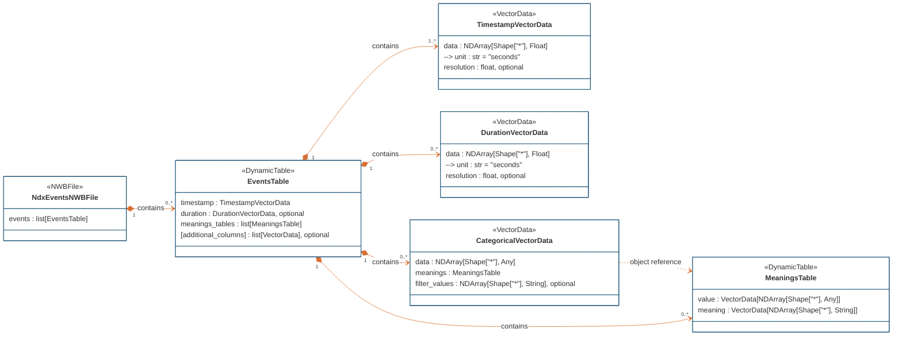

# ndx-events Extension for NWB

This is an NWB extension for storing timestamped event data.

The latest version is 0.4.0. This is a major change from previous versions.

1. A `TimestampVectorData` type that extends `VectorData` and stores a 1D array of timestamps (float32) in seconds
   - Values are in seconds from session start time (like all other timestamps in NWB)
   - It has a scalar string attribute named "unit". The value of the attribute is fixed to "seconds".
   - It has an optional scalar float attribute named "resolution" that represents the smallest possible difference between two timestamps. This is usually 1 divided by the sampling rate for timestamps of the data acquisition system. (Alternatively, the event sampling rate could be stored.)
   - This type can be used to represent a column of timestamps in any `DynamicTable`, such as the NWB `Units` table and the new `EventsTable` described below.
2. A `DurationVectorData` type that extends `VectorData` and stores a 1D array of durations (float32) in seconds. It is otherwise identical to the `TimestampVectorData` type.
   - If this is used in a table where some events have a duration and some do not (or it is not known yet), then a value of NaN can be used for events without a duration or with a duration that is not yet specified. If the latter, the mapping should be documented in the description of the `DurationVectorData`.
3. A `CategoricalVectorData` type that extends `VectorData` and stores the mappings of data values (of any type) to meanings. This is an experimental type to evaluate one possible way of storing the meanings (longer descriptions) associated with different categorical values stored in a table column. This can be used to add categorical metadata values to an `EventsTable`.  This type will be marked as experimental while the NWB team evaluates possible alternate solutions to annotating the values of a dataset, such as LinkML-based term sets, non-table based approaches, and external mapping files.
   - The type contains an object reference to a `MeaningsTable` named "meanings". See below. Unfortunately, because `CategoricalVectorData` is a dataset, it cannot contain a `MeaningsTable` within it, so the `MeaningsTable` is placed in the parent `EventsTable` and referenced by the `CategoricalVectorData`.
   - It may also contain an optional 1D attribute named "filter_values" to define missing and invalid values within a data field to be filtered out during analysis, e.g., the dataset may contain one or more of: "undefined" or "None" to signal that those values in the `CategoricalVectorData` dataset are missing or invalid. Due to constraints of NWB/HDMF attributes, attributes must have a dtype, so currently, only string values (not -1 or NaN) are allowed.
   - This type is similar to an `EnumData`, which is a `VectorData` of an enumerated type, except that the values stored in the column are strings that are short-hand representations of the concept, as opposed to integers. Storing strings is slightly less efficient than storing integers, but for these use cases, these tables will rarely be large and storing strings directly is more intuitive and accessible to users.
4. A `MeaningsTable` type that extends `DynamicTable` with two required columns:
   - A "value" column that contains all the possible values that could be stored in the parent `CategoricalVectorData` object. For example, if the `CategoricalVectorData` stores the port in which the subject performed a nose poke, the possible values might be "left", "center", and "right". All possible values must be listed, even if not all values are observed, e.g., if the subject does not poke in the "center" port, "center" should still be listed to signal that it was a possible option.
   - A "meaning" column with string dtype that contains a longer description of the concept. For example, for the value "left", the meaning might be "The subject performed a nosepoke in the left-most port, from the viewpoint of the subject. This is signaled by detection of the port’s infrared beam being broken."
   - Users can add custom, user-defined columns to provide additional information about the possible values, such as [HED (Hierarchical Event Descriptor)](https://www.hed-resources.org/en/latest/) tags. For HED tags, users may consider using the `HedTags` type, a subtype of `VectorData`, in the [ndx-hed extension](https://github.com/hed-standard/ndx-hed).
   - As described in `CategoricalVectorData`, this arrangement will be marked as experimental.
5. An `EventsTable` type for storing a collection of event times that have the same parameterizations/properties/metadata (i.e., they are the same type of event, such as licks, image presentations, or reward deliveries)
   - It inherits from `DynamicTable` and stores metadata related to each event time / instance, one per row.
   - It has a "timestamp" column of type `TimestampVectorData` is required.
   - It has a "duration" column of type `DurationVectorData` is optional.
   - Because this inherits from `DynamicTable`, users can add additional custom columns to store other metadata, such as parameterizations of an event, e.g., reward value in uL, image category, or tone frequency.
   - The "description" of this table should include information about how the event times were computed, especially if the times are the result of processing or filtering raw data. For example, if the experimenter is encoding different types of events using a "strobed" or "N-bit" encoding, then the "description" value should describe which channels were used and how the event time is computed, e.g., as the rise time of the first bit.
   - It contains a collection of `MeaningsTable` objects referenced by any `CategoricalVectorData` columns. These columns are placed in a subgroup of the EventsTable named "meanings". Alternatively, these `MeaningsTable` objects could be placed under the root `NWBFile`, but it is probably more useful to keep them close to the objects that they describe. As described in `CategoricalVectorData`, this arrangement will be marked as experimental.

The PyNWB and MatNWB APIs would provide functions to create these tables. For example, in PyNWB:

```python
stimulus_presentation_events = EventsTable(name="stimulus_presentation_events")
stimulus_presentation_events.add_column("stimulus_type", col_cls=CategoricalVectorData)
stimulus_presentation_events.add_row(timestamp=1.0, stimulus_type="circle")
stimulus_presentation_events.add_row(timestamp=4.5, stimulus_type="square")
nwbfile.add_events_table(stimulus_presentation_events)
```

The APIs would also provide the following interfaces:
- `nwbfile.events_tables` returns a dictionary of `EventsTable` objects, similar to `nwbfile.acquisition`
- Use `nwbfile.events_tables["stimulus_presentation_events"]` to access an `EventsTable` by name
- `nwbfile.merge_events_tables(tables: list[EventsTable])`, which merges a selection of `EventsTable` objects into a read-only table, sorted by timestamp
- `nwbfile.get_all_events()`, which merges all the `EventsTable` objects into one read-only table, sorted by timestamp

This extension was developed by Ryan Ly, Oliver Rübel, the NWB Technical Advisory Board, and the NWBEP001 Review Working Group.

Information about the rationale, background, and alternative approaches to this extension can be found here:
https://docs.google.com/document/d/1qcsjyFVX9oI_746RdMoDdmQPu940s0YtDjb1en1Xtdw

## Installation

The latest **ndx-events 0.4.0** has not yet been released on PyPI. To install it on Python, use:
```bash
pip install git+https://github.com/rly/ndx-events.git
```

ndx-events 0.3.0 was not released on PyPI.

To install the 0.2.0 version, use:
Python:
```bash
pip install -U ndx-events
```

Matlab:
```matlab
generateExtension('<directory path>/ndx-events/spec/ndx-events.namespace.yaml');
```

## Usage examples

1. [Example writing TTL pulses and stimulus presentations to an NWB file](examples/write_ttls_events.py).


## Diagram




## Developer installation

In a Python 3.8-3.12 environment:
```bash
pip install -r requirements-dev.txt
pip install -e .
```

Run tests:
```bash
pytest
```

Install pre-commit hooks:
```bash
pre-commit install
```

Style and other checks:
```bash
black .
ruff .
codespell .
```


This extension was created using [ndx-template](https://github.com/nwb-extensions/ndx-template).
